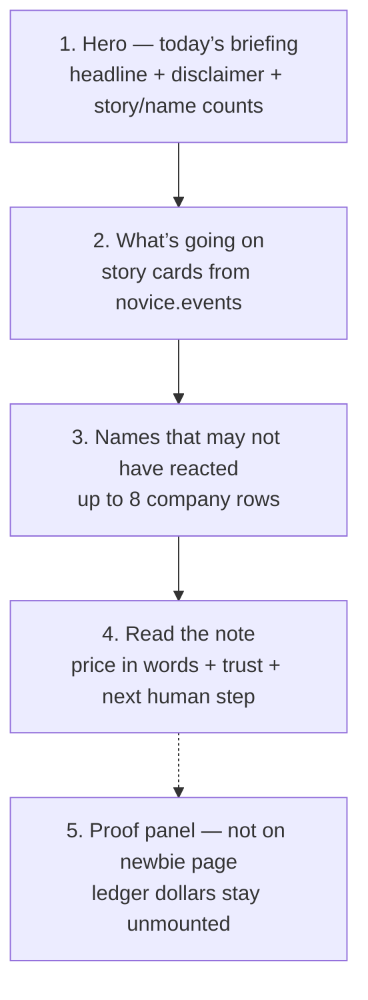
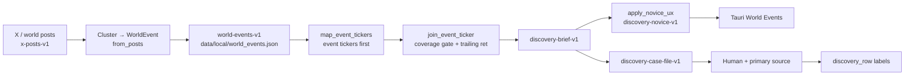
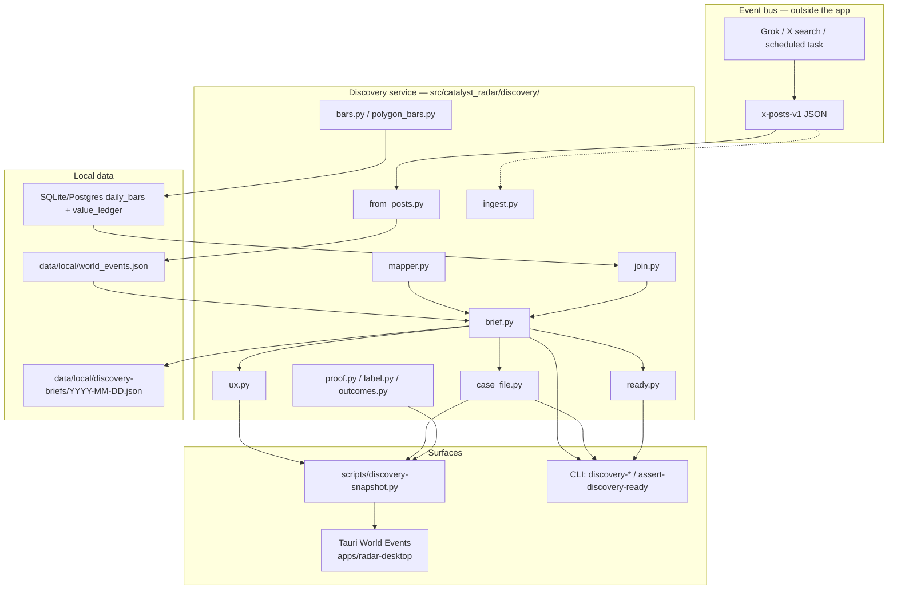
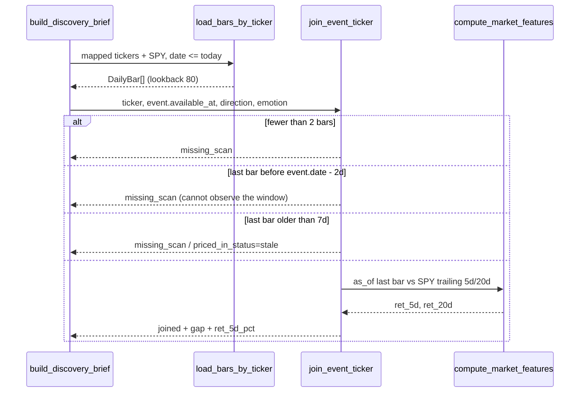

# MarketRadar Product Spec

**Title:** MarketRadar — event-first discovery briefing  
**Author:** Product + Engineering  
**Date:** 2026-08-15  
**Status:** Draft (revised after design review)  
**Checkout:** `marketradar-square-one-spec` @ `origin/main` `b20c294`  
**Audience:** A new PM and a new engineer sharing one product contract  
**Supersedes as product contract:** `docs/PRODUCT_SCOPE.md` (this spec is the narrative; that file becomes a pointer plus ship-gate table)  
**Does not supersede:** `docs/DEPRECATION.md` (removal registry) or `src/catalyst_radar/deprecation.py` (runtime scope)

This is a combined PM spec and system design. It is not a changelog of past phases, not a trading-platform RFC, and not investment advice. The code already in `src/catalyst_radar/discovery/` is the implementation substrate. The product is defined here as if for the first time.

**Revision 2026-08-15c:** Clustering is authoritative `event_id` plus today’s first-theme/`post_id` fallback — Jaccard is not an SLA on the live 8-post dump. Story rank+cap lands in PR 6; PR 3 does not freeze the uncapped list. Jargon denylist is visible copy only.

---

# Part A — Product / PM spec

## 1. One-sentence product

**MarketRadar is an operator-produced weekday briefing that a market newbie can read: public world events, mapped to companies, with honest recent-tape context and a trust ladder. It is decision support only.**

Shorter variant for the app kicker: *Stories from X, then which stocks have not moved much yet.*

“Recent tape” on this checkout means trailing 5-session / 20-session returns **after a coverage gate** (bars exist near the event and are not stale). It is **not** return-since-`available_at`. See §18 and Key Decisions.

## 2. Vision (what winning looks like in 6–12 months)

An **operator** owns the weekday file. A **market newbie** opens the desktop and, in a few minutes, can answer:

1. **What happened** that markets might care about? (A short card list — **at most 8** stories, never padded.)
2. **Which companies does that touch**, in company names, not theme slugs?
3. **What has the recent tape done**, in words (“Micron has barely moved this week”), given bars fresh enough to observe the event window?

Winning is **asymmetric attention**. The product is useful when a human spends ten minutes on the right name and skips the already-priced or fake ones. It is not useful when it prints a shopping list, a 12,000-name scan, or an “AI pick.”

By month 12:

- The **operator** has installed a local `world-events-v1` file on most weekdays before the reader sits down (target: 09:00 local).
- The default desktop is a briefing a first-time user can read without a CLI or PowerShell.
- Top leads have **coverage-join** price context for at least half of the top-20 names.
- Briefing-queue `usefulness` for social/promotional rows stays `research_only`.
- The operator can look back at helped/noise labels and say whether the radar was worth time.

## 3. Problem statement

### Job to be done

When something public is **pending or just printed** — a Phase 3 window, a PDUFA date, a shipping choke point, a memory-price shock — a curious investor wants to know: *what is the story, which listed companies sit on the causal chain, and has the tape already made the move obvious?*

The highest-value object is a **pending binary** (dated or windowed) whose names are still quiet. The day-of “stock +100%” post is too late. Teaching case and taxonomy: `docs/designs/2026-08-19-catalyst-signals.md` (Moderna melanoma vaccine, 2026).

That job is **research triage**, not execution. Join still reports trailing 5d plus optional `ret_since_event_pct`; newbie copy stays honest.

### Pain

| Pain | What it feels like |
|------|--------------------|
| Firehose | X, wires, and scanners produce more items than a human can rank. |
| Already priced | The loudest names have already moved; “hot ticker” ≠ “quiet recent tape.” |
| Rumor as fact | Social velocity looks like news. Acting on it is how people get hurt. |
| Operator consoles | Theme slugs, `missing_scan`, and PowerShell next-actions fail a market newbie. |
| Wrong unit of work | Counting posts or scanning 12k names hides that **three stories** drove the day. |
| Inverted loop | Filling residual SEC/bar gaps for a full universe blocks the useful question. |
| Unowned feed | A consumer briefing with no weekday file owner is an empty app. |

### Current alternatives

| Alternative | What it does well | Why it is not this product |
|-------------|-------------------|----------------------------|
| News terminal (Bloomberg, etc.) | Complete firehose, primary sources | Starts from *everything*; does not rank quiet recent tape on mapped names. |
| Twitter / X client | Live conversation | No equity map, no coverage join, no trust ladder. |
| Broker / trading workbench | Orders, blotter, risk | Different job. MarketRadar never submits orders. |
| Stock scanner | Liquidity, technicals, full universe | Starts from tickers, not world events. |
| “AI stock picker” | Confidence theater | Claims a pick. MarketRadar ranks attention and refuses advice. |

## 4. Who it is for, and who it is not for

MarketRadar is an **operator-produced briefing a market newbie can read.** Two roles, one product object.

| Role | Job | Owns |
|------|-----|------|
| **Operator (customer of the loop)** | Produce or install today’s `x-posts-v1` / `world-events-v1`, optionally fill mapped bars, label whether a lead was worth attention. May use the CLI. | Weekday file. Without this person, there is no briefing. |
| **Market newbie (primary UX reader)** | Open World Events, read stories and names in English, tap a note, check a regular news site. **Never runs a CLI.** | Nothing operational. Cannot create the feed. |

Both share: **a story → mapped names → coverage-joined recent tape → human confirmation.**

### Not for

- Anyone who wants MarketRadar to **tell them what to buy**.
- A consumer who expects the app to fetch X by itself (no in-app OAuth, no self-serve feed).
- Day traders who need order tickets, paper blotters, or broker desks.
- Compliance teams that need a complete news archive or X timeline.
- Quant teams that need full-universe residual-repair of 12k names as the daily loop.

## 5. Core value proposition

**The operator clusters the day’s public conversation into a few stories. MarketRadar maps those stories to companies and shows — honestly — what the recent tape has done, with bars that can observe the event window.**

The scarce resource is **attention**. The product’s job is to spend it on:

1. Stories that are real enough to research (briefing-queue social rows stay `research_only`).
2. Names that sit on the event (event-declared tickers first; unlisted cashtags do not consume the newbie eight).
3. Names whose **recent tape** is quiet or whose bars are missing — not leftover `candidate_states` rows.

What we explicitly do **not** sell: expected return, a ranked buy list, or autonomous action.

## 6. Product principles / laws (non-negotiable)

These are product laws, not style preferences. Implementation that weakens them is out of scope.

1. **Decision support only.** Every discovery payload sets `investment_advice: false`, `can_make_investment_decision: false`, `decision_support_only: true`. The UI says “not a buy recommendation.”
2. **Browse is silent.** Opening World Events, running `scripts/discovery-snapshot.py`, or `discovery-brief` makes **zero** hidden provider, broker, or LLM calls. `external_calls_made = 0`, `db_writes_made = 0` unless the human passed an explicit write/confirm flag.
3. **Briefing-queue social stays `research_only`.** The law field is `discoveries[].usefulness` on `discovery-brief-v1` / `event_discovery` (the queue the newbie sees). For `source_category` in `{social, promotional}` or `source_quality < 0.45`, that field is **always** `research_only`. This is what `AGENTS.md` and `docs/PRODUCT_SCOPE.md` mean by “social/X-only leads stay `research_only`.”  
   The case file may raise a **different** field — `case_file.usefulness` / `trust_ladder.current` — to `watch` as an **attention band** when confirmation is `primary_confirmed` or `corroborated_reputable`. `watch` is not capital and is **not** “left `research_only`” for Law 3. There is no “equivalent primary” escape hatch on the briefing queue.
4. **No broker path.** Discovery never auto-submits, previews-as-product, or deep-links into order tickets. There is no “Buy” that hits a broker.
5. **Do not block on the universe.** Usefulness must not wait for full-universe SEC residual fill or grouped-daily of ~12k names.
6. **Polygon is mapped `/v2/aggs` only.** Discovery bar fetch is event tickers + benchmark (default `SPY`), never grouped-daily as the discovery path. Cap the set. Sleep ~1.1s between symbols; sleep/retry on HTTP 429.
7. **Coverage join, not leftover state.** A name is `joined` only when local daily bars exist **near the event** (last bar not more than 2 calendar days before `available_at.date`, and last bar &lt; 7 days stale vs now). Reaction is **trailing** `ret_5d` / `ret_20d` as-of that last bar — not return since `available_at`. Old `candidate_states` rows do not count. Missing/stale bars are `missing_scan`, never quiet tape.
8. **The unit of the briefing is a story.** **Story = one `world-events-v1` event = one `novice.events[]` row.** The UI counts `novice.events.length`, not raw posts. Clustering (from-posts) is how some files *produce* those events. Eight posts that share three `event_id`s become **three** `world-events-v1` events → three stories. A 3–8 card list is a **selection cap** (rank, cap 8, never pad), not a clustering promise.
9. **Event tickers first.** Theme expansion is secondary and discounted. Theme-only names without a price join do not occupy the newbie queue. Unlisted / non-US-common cashtags stay on the operator event JSON; they do not consume `NOVICE_LIMIT`.
10. **Newbie copy is plain English.** Company names, price in words, no theme slugs, no `missing_scan` jargon, no PowerShell as the next action on the default surface.
11. **Grok/X search is the event bus.** MarketRadar does not need in-app X OAuth. The operator (or a scheduled Grok task **outside** the app) writes a file; the product reads it.
12. **Ship gate is discovery-ready.** `catalyst-radar assert-discovery-ready --json`. Do not use `assert-trial-ready`, `assert-shadow-ready`, or `assert-investable-readiness`.
13. **Capture the pending binary, not the gap-up.** Weekday stories must be type A/B in `docs/designs/2026-08-19-catalyst-signals.md` (windowed catalyst + names + quiet-enough tape). Intraday “JUST IN +130%” posts are type X and must not crowd the briefing.

## 7. Primary user journeys

### Journey A — Newbie morning briefing (default UX; reader only)

Assumes the operator already installed today’s file (Journey B). The newbie never creates the feed.

```text
Open desktop (World Events is home)
        │
        ▼
Read the hero: “3 stories from X. Micron has barely moved this week.”
        │
        ▼
Scan “What’s going on” — up to 8 story cards (titles, company names, mood)
        │
        ▼
Scan “Names that may not have reacted yet” — up to 8 company rows
        │
        ▼
Tap one name → “Read the note”
   • What the stock did (price in words)
   • How sure is this? (social = unconfirmed)
   • What you should do: check a regular news site
        │
        ▼
Optional: tap “This helped” / “This was noise”
        │
        ▼
Leave. Do not buy from this screen.
```

Refresh is **R** / current snapshot copy “Press R to refresh this briefing.” It re-reads local files. It does not call Polygon, a broker, or an LLM.

**Empty / stale / last-good** (target). Current checkout differs — see §24.

| State | What the newbie sees (target) | Who acts |
|-------|-------------------------------|----------|
| No `data/local/world_events.json` | Empty: current `_headline` when `events=[]` — “No stories loaded yet. Add today's world events to get started.” **Do not** fall back to the July sample. | Operator installs a file. Newbie cannot. |
| Local file stale (`generated_at` &gt; 24h) | **Last-good** stories remain visible. Headline = current stale string: “This briefing is out of date. Refresh the news feed, then come back.” | Operator replaces the file. |
| Fresh file, stories, no eligible names | Current `_headline` when `top is None`: “N story from X today.” / “N stories from X today.” Current `_next_action`: “When stories appear, start with the first name and read why it showed up.” (copy talks about stories, not names.) | Operator maps tickers / fills bars. |
| Operator away | Last-good + stale banner. Never invent or pad stories. | Wait. |

**Current vs that table:** with no local file, `default_events_path()` / snapshot fall back to `data/sample/world_events.json` (`generated_at` 2026-07-19) — a **stale July briefing**, not empty. That is a bug relative to this spec (PR 6).

### Journey B — Operator research path (how the briefing exists)

```text
Weekday Grok/X task (outside the app) writes x-posts-v1
   — required: event_id on each post; see §15.1
        │
        ▼
catalyst-radar discovery-from-posts --posts … --execute
   → data/local/world_events.json   (world-events-v1)
   OR discovery-ingest of an already-built bundle
        │
        ▼
Optional: discovery-bars --polygon --confirm-external-call --execute
   → daily_bars for event tickers + SPY
        │
        ▼
discovery-brief / discovery-insights / assert-discovery-ready
        │
        ▼
Newbie opens World Events   OR   operator runs discovery-case MU
        │
        ▼
Confirm on a primary source (news / filing) — usually off-app
        │
        ▼
Desktop “This helped / This was noise”  OR  discovery-label
        │
        ▼
After bars advance: discovery-outcomes (operator)
```

The operator path may show join coverage, `event_id`, and ledger artifact ids. The newbie path must not require those tokens.

## 8. Information hierarchy of the UI

Default desktop nav is **World Events + Help** (`apps/radar-desktop/frontend/app.js` `renderNav`; legacy pages only if `CATALYST_ENABLE_LEGACY_WORKBENCH=true`).



| Rank | Surface | Question it answers | Source in snapshot |
|------|---------|---------------------|--------------------|
| 1 | Hero | What kind of day is this? | `event_discovery.headline`, `novice.disclaimer` |
| 2 | Stories | What happened? | `event_discovery.novice.events` |
| 3 | Names | Who might have a quiet recent tape? | `event_discovery.discoveries` after `apply_novice_ux` |
| 4 | Note | Why this name, how sure, what to do? | `event_discovery.case_file` + company/price overlay |
| 5 | Proof (operator) | Was last week’s radar worth time? | `event_discovery.proof` / `discovery_proof` — **payload present, panel unmounted** |

**Rule:** Story cards come from `novice.events[]` (= `world-events-v1` events), never from a raw post list. Hero metrics are “stories” and “names to read.”

**Today (plain):** `renderWorldEvents` implements 1–4. **“This helped” / “This was noise” are already mounted** on the note (`renderCaseLabelButtons`). A ghost **“preview good-research”** button is also mounted. `renderDiscoveryProof` exists and includes claimable USD / 5d outcome % but is **not** called. Open Question 2’s recommendation (buttons on, dollars off) **is the current UI**; remaining work is hide the preview ghost and lock the unmounted proof with a test (PR 6 / PR 7).

**12 → 8 pipeline (undocumented today):** discovery-home `filterInput()` sets `scan_limit: 12` (`app.js`). Snapshot builds a brief with `limit=12`, then `_pick_novice_leads` keeps 8 names. A lead ranked 13+ never reaches the novice picker. Target: pass `scan_limit = 20` (`ready.TOP_N`) before novice filtering.

## 9. Success metrics

### Ship gate (engineering invariants — already in `ready.py`)

```text
catalyst-radar assert-discovery-ready --json
```

| Check | Number | Code |
|-------|--------|------|
| Events file exists | — | else `missing_events` |
| Freshness | `generated_at` age **≤ 24h** | `FRESHNESS_STALE_HOURS = 24` |
| Coverage join on top-20 | **≥ 50%** `joined` | `JOIN_TARGET_PCT = 50`, `TOP_N = 20` |
| Safety | `investment_advice is False` | ready fails otherwise |

`data/sample/world_events.json` is a **fixture**. Using it as live is a product bug. Converting an old dump today sets `generated_at` to the conversion clock (`from_posts`) and can falsely pass freshness — operator must not do that.

Do not use trial / shadow / investable readiness.

### Product metrics (steer the next quarter)

| Metric | Target | Source | Week-1 proxy |
|--------|--------|--------|--------------|
| Weekday file delivered | **≥ 80%** of Mon–Fri: local `world_events.json` exists, `generated_at` &lt; 24h, **and** newest event `available_at` &lt; 48h; operator aims for **09:00 local** | Snapshot `events_path`, `events_generated_at`, max event `available_at` | Log those three fields on each desktop refresh |
| Company-name coverage | **≥ 90%** of novice name rows have a `COMPANY_NAMES` hit | `apply_novice_ux` leads | Unit test on `x_posts_2026-08-13.json` + `DEFAULT_THEME_TICKERS` |
| Jargon-free **visible** copy | **100%** of mounted `case_file.next_action`, hero/note text, and **button labels** pass denylist `{missing_scan, powershell, paper path, preview good-research}` | Snapshot overlay + `renderWorldEvents` / `renderDiscoveryCaseFile` text nodes | PR 6 test on those strings only. `data-label="good-research"` and ledger JSON may keep the token. |
| Briefing-queue social cap | **0** from-posts / social rows with `discoveries[].usefulness != research_only` | brief payload | Existing `test_discovery_brief` + from-posts fixture |
| Sample fallback | **0** desktop sessions with `events_path_kind=fixture` after PR 6 | snapshot field (new) | Fail ready / show empty if path is under `data/sample/` |
| Helped vs noise | Record `helped / (helped + noise)` after **≥ 20** labels in 30 days. **No target mix yet** (research) | `discovery-proof-v1` `summary.by_label` (`good-research` = helped, `noisy` = noise) | Proof summary after a handful of labels |

### Not metrics until instrumented (research questions)

- Time-to-brief &lt; 5 minutes (no session clock).
- “User treated rank as a buy list” / “acted on a rumor” — no in-app trade, so no conversion pixel; mitigate with copy + Law 3, do not pretend we measure it.
- Desktop command mix (only `{label, refresh}` for newbies) — label clicks already go `execute_dashboard_command` → snapshot `--command`; no aggregate counter yet.

## 10. Explicit non-goals

- Autonomous trading, paper-trading-as-product, or broker order tickets.
- Investment advice, expected-return forecasts, or “AI picks that print money.”
- Becoming a news terminal, X client, or full-market scanner.
- In-app X OAuth or a self-serve consumer feed.
- Blocking the briefing on full-universe SEC residual fill.
- Grouped-daily of the active universe as the discovery bar path.
- Expanding the trading workbench, IPO desk, alerts-as-product, agent cockpit, or Streamlit/TUI workbench.
- Joining discovery through `dashboard.data.load_candidate_rows`.
- Treating `handoff.md` or `docs/legacy/` as the current contract.
- Using trial / shadow / investable readiness as the ship gate.

Deprecated surfaces may remain importable behind `CATALYST_ENABLE_LEGACY_WORKBENCH=true`. They are not the product.

## 11. Positioning

| They are… | MarketRadar is… |
|-----------|-----------------|
| A **news terminal** | A **short ranked briefing**. We throw away most of the firehose. |
| A **Twitter client** | A **file-fed event bus**. Grok/X search happens outside. No timeline, no OAuth. |
| A **broker** | **Research only.** No orders, no positions, no “eligible to buy” as a CTA. |
| A **scanner** | **Event-first.** We do not start from 12k names and hunt a catalyst. |
| An **AI stock picker** | A **trust-laddered attention ranker.** Scores rank research order, not expected return. LLM, if used at all later, is sparse synthesis — never the score owner. |
| A **consumer news app** | An **operator appliance with a newbie-readable face.** No operator, no briefing. |

One line:

> MarketRadar is the weekday briefing that asks: *what happened, who does it touch, and what has the recent tape done?* An operator feeds it. It will not trade for you.

## 12. Product risks

| Risk | Severity | Why it happens | Mitigation |
|------|----------|----------------|------------|
| **Misinformation** | High | X is the event bus; rumors cluster like news. | Emotion cap 70 on social. **Law 3:** briefing-queue `usefulness` stays `research_only`. Disclaimer. Human confirmation off-app. |
| **Already-priced names** | High | Loud stories move mega-caps first. | Coverage join + trailing reaction; quiet-tape boost; mega-cap demote; “already moved” case copy. Later: return-since-event (PR 10). |
| **Thin X coverage** | Medium | A real event may have 1–2 posts, or none. | Story count may be 1. Empty is honest. Do not pad. |
| **Rate limits (429)** | Medium | Theme expansion to dozens of Polygon tickers. | Default bar set = event tickers + `SPY`. `/v2/aggs`. Sleep 1.1s; 12s retry on 429. Record 404s; do not retry them every morning. |
| **Wrong unit (posts vs stories)** | Medium | UI that lists posts looks busy. | Count `novice.events`. 8/3 fixture is the teaching example. |
| **Newbie rejection** | Medium | Operator jargon and PowerShell. | Novice envelope. PR 6 overwrites mounted `next_action`. |
| **Advice theater** | High | Users treat rank as a buy list. | Flags, copy, no order path, labels = attention value. |
| **Stale fixture as live** | High (today) | `default_events_path()` falls back to July sample. | PR 6: no sample fallback on desktop; `events_path_kind=fixture` refused. |
| **Unowned weekday file** | High | Newbie cannot create the feed. | Operator is the loop customer. Grok-task contract §15.1. Last-good + stale if they are away. |
| **Mapping / cashtag noise** | Medium | `$SKHY`, `$CXMT`, `$DRAM` occupy the newbie eight. | Keep on operator JSON; drop unlisted from novice (§17). |
| **False freshness** | Medium | `from_posts` sets `generated_at` to conversion clock. | Operator contract: do not install an old dump as today. Product metric also watches `available_at`. |

---

# Part B — Design / how it should work

## Glossary

| Term | Meaning |
|------|---------|
| **Story** | One `world-events-v1` `events[]` item = one `novice.events[]` row. UI “stories” = `novice.events.length`. |
| **Post** | One `x-posts-v1` `posts[]` item. Never the UI unit. |
| **`event_id` (post field)** | Clustering key supplied by the Grok task. Authoritative when present. |
| **`WorldEvent.id`** | After from-posts: `evt_{slug(group_key)}`. Hand-authored bundles may use any stable id. |
| **Briefing-queue usefulness** | `discoveries[].usefulness`. **Law 3 field.** |
| **Case attention** | `case_file.usefulness` / `trust_ladder.current`. May be `watch`. Not Law 3. |
| **Coverage join** | Bars near the event + freshness. Not return-since-event. |
| **Operator** | Person (or out-of-repo task they run) who installs the weekday file. |
| **Newbie** | Reader of World Events. No CLI. |

## 13. Design thesis and the inverted loop

The product object is the **world event**, not the universe scan.

```text
event  →  map names  →  coverage-join recent tape  →  human confirms
```

That inverts the unhelpful loop (fill every residual bar/filing → maybe discover). Discovery must be useful on a **mapped set** the size of today’s stories.



Deterministic scoring stays. Fail-closed trust stays. What changes versus a scanner is **where the list comes from**.

## 14. Architecture



**Call laws on this diagram:** arrows from `tauri` / snapshot / `discovery-brief` back to Polygon, brokers, or LLMs **do not exist**. The only approved outbound market-data arrow is `discovery-bars --polygon --confirm-external-call` (and equivalent explicit scripts).

Supporting — not hero — packages: `scoring` / `features.market` (reaction math), `storage` (bars + ledger), `events` (optional SOCIAL fan-out + local primary lookup), `connectors.polygon` (only via explicit confirm).

## 15. Daily operating loop

| Step | Who | Command / surface | Calls |
|------|-----|-------------------|-------|
| 1. Collect public posts | **Operator** / Grok task | Write `x-posts-v1` per §15.1 | Outside MarketRadar |
| 2. Cluster into stories | Operator | `discovery-from-posts --execute` | 0 provider; 1 file write |
| 3. Or install a ready bundle | Operator | `discovery-ingest --execute` / `scripts/refresh-world-events.ps1` | 0 provider |
| 4. Fill coverage-join bars | Operator, optional | `discovery-bars --polygon --confirm-external-call --execute` | N = event tickers + SPY |
| 5. Brief | Operator / tests | `discovery-brief --json` | 0 provider |
| 6. Read | **Newbie** | Tauri World Events (refresh re-reads files) | 0 provider |
| 7. Case | Newbie click / operator CLI | Note panel / `discovery-case TICKER` | 0 provider |
| 8. Confirm | Human | Regular news / SEC — usually **off-app** | 0 in-app |
| 9. Label | Newbie buttons or operator CLI | snapshot `--command label` / `discovery-label` | 0 provider; local ledger if execute |
| 10. Gate | CI / operator | `assert-discovery-ready --json` | 0 provider |

Delivery to the newbie machine: **local drop.** The desktop reads `data/local/world_events.json` on that machine. There is no in-app sync. Out-of-repo work: schedule the Grok task and copy/install the file (script, drop folder, or later sync — not in-app OAuth).

Convenience wrapper (still explicit): `scripts/run-real-discovery.ps1 -Execute -ConfirmExternalCall` runs from-posts → polygon bars → insights → ready.

Do **not** treat `scripts/fill-discovery-gaps.ps1` as the north-star. Capture is already `skipped_full_market_not_discovery`. The specified discovery bar path is `polygon_bars.fetch_polygon_daily_bars` (`/v2/aggs/ticker/{symbol}/range/1/day/...`). PR 8 retargets operator `next_command` only.

### 15.1 Grok-task / `x-posts-v1` contract

Required of the weekday dump (operator or scheduled task):

| Field | Rule |
|-------|------|
| `schema_version` | `x-posts-v1` |
| `generated_at` | Clock when **this dump was produced**, ISO-8601. Not a recycled July stamp. |
| `source` | Stable task name, e.g. `grok_x_daily` |
| `posts[]` | Non-empty |
| `posts[].id` | Stable post id |
| `posts[].event_id` | **Required.** Shared across posts that are the same story. This is the clustering contract. |
| `posts[].title` or `text` | At least one |
| `posts[].published_at` | ISO-8601 |
| `posts[].tickers` and/or cashtags in `text` | At least one ticker after parse, **or** `themes` (else the group is dropped) |
| `posts[].themes` | Recommended |
| `posts[].direction` | `bullish` \| `bearish` \| `mixed` |
| Optional | `url`, `author`, `materiality`, `source_quality`, `engagement` |

From-posts sets bundle `generated_at` to the **conversion clock** and event `available_at` to the **earliest** `published_at` in the group. Ship-gate freshness is bundle `generated_at`. Do not convert an old dump and call it today.

Missing `event_id` is an operator-contract miss. From-posts then uses **today’s** fallback (`first theme` else `post_id`) — not a Jaccard merge. The task is still required to set `event_id`.

**What to search for (not optional after 19 Aug 2026):** PDUFA / FDA dates in the next 90 days; Phase 2/3 or pivotal “readout / top-line / fully enrolled”; major medical-meeting data tied to a ticker; IR / trial-registry hooks. Do **not** fill the dump from trending “stock is up 100%” posts. See `docs/designs/2026-08-19-catalyst-signals.md`.

### 15.2 Empty vs stale vs last-good (operator away)

| Condition | Product behavior |
|-----------|------------------|
| Missing local file | **Empty** briefing. No sample fallback (target). |
| Local file present, `generated_at` &gt; 24h | Show **last-good** events + stale headline. Do not hide yesterday. |
| Local file present, fresh, zero events | Empty stories, honest count. Do not pad from themes. |
| Operator does not run the task | Last-good + stale until they do. Month-12 “most weekdays fresh” is an **operator staffing** metric, not a client fetch. |

## 16. Data contracts

### 16.1 `x-posts-v1`

Produced **outside** the app. Consumed by `load_x_posts` / `build_world_events_from_posts` in `from_posts.py`.

```json
{
  "schema_version": "x-posts-v1",
  "generated_at": "2026-08-13T12:00:00+00:00",
  "source": "x_live_curated_2026-08-13",
  "posts": [
    {
      "id": "2087835043771089010",
      "event_id": "hbm4_memory_asp",
      "title": "HBM4 ramp and conventional memory ASPs dominate 2H earnings setup",
      "text": "$MU $SKHY …",
      "url": "https://x.com/…/status/…",
      "author": "@example",
      "published_at": "2026-08-13T09:33:59+00:00",
      "themes": ["memory", "hbm", "semiconductor"],
      "tickers": ["MU", "SKHY"],
      "direction": "bullish",
      "materiality": 0.78,
      "source_quality": 0.44,
      "engagement": {"likes": 14, "views": 1443}
    }
  ]
}
```

**Current clustering** (`_parse_post`): `group_key = event_id` if present, else first theme, else `post_id`. Cashtags in `text` are merged into tickers.

**Story-count fixture (the law for PR 3):** `data/sample/x_posts_2026-08-13.json` — **8 posts**, **3** `event_id`s (`hbm4_memory_asp`, `china_nand_share`, `cpi_hormuz_macro`) → **3** `world-events-v1` events → **3** `novice.events`.  
`data/sample/x_posts.json` is a **different**, 2-post smoke file. Do not use it as the story-count law.

### 16.2 `world-events-v1`

Canonical event bundle. Written to `data/local/world_events.json`. Parsed by `load_world_events` (`brief.py`) into `WorldEvent` / `WorldEventBundle` (`models.py`).

Required fields per event: `id`, `title`. Useful fields:

| Field | Role |
|-------|------|
| `id` | Stable story id (`evt_…` after from-posts) |
| `title` / `summary` | What the newbie reads |
| `themes` | Secondary expansion keys into `DEFAULT_THEME_TICKERS` / `config/theme_peers.yaml` |
| `tickers` | **Primary** mapped names (event-declared) |
| `secondary_tickers` | Explicit second-order names |
| `direction` | `bullish` \| `bearish` \| `mixed` |
| `materiality` / `source_quality` | 0–1; feed emotion score |
| `source_category` | Usually `social` on this path |
| `sources[]` | Provider, URL, author, published_at, engagement |
| `available_at` | Event clock for the coverage gate |

Bundle: `schema_version`, `generated_at` (**ship-gate freshness clock**), `source`, `events[]`.

### 16.3 `discovery-brief-v1`

Built by `build_discovery_brief`. Zero provider calls. Optional local DB for joins only.

Top-level flags that must never flip on browse:

- `investment_advice: false`
- `can_make_investment_decision: false`
- `decision_support_only: true`
- `external_calls_made: 0`
- `db_writes_made: 0`

Also carries: `events_age_hours`, `freshness_status` (`fresh` if ≤ `FRESHNESS_STALE_HOURS` = **24**), `events[]` (with `mapped_tickers`), `discoveries[]`, `join_coverage`, `goal_status` (`discovery-goal-status-v1`).

A discovery row includes `ticker`, `event_id`, `event_title`, `origin` (`event` \| `event_secondary` \| `theme`), `join_status`, `ret_5d_pct`, `quiet_tape`, `emotion_reaction_gap`, `usefulness` (**Law 3 field**), `why_now`.

From-posts always sets `source_category: "social"`, so `_usefulness` keeps every such row at `research_only` on this field.

Operator `next_command` on the raw brief may still mention PowerShell (`_next_operator_step`). That is **not** the newbie next action. `apply_novice_ux` overwrites brief-level `next_action` / `next_command`; it does **not** rewrite `case_file.next_action`.

### 16.4 Novice UX envelope (`discovery-novice-v1`)

`apply_novice_ux` (`ux.py`) wraps a brief for first-time users. Snapshot **always** applies it (`scripts/discovery-snapshot.py`).

```text
novice.schema_version = discovery-novice-v1
novice.tagline        = "Stories from X, then which stocks have not moved much yet."
novice.disclaimer     = research briefing, not a shopping list, check a real news site
novice.events[]       = { id, title, summary, mood, names, tickers }
novice.leads[]        = { ticker, name, event_title, why, price_line, status_line }
novice.focus_ticker
```

**Events (today):** copied in full — N brief events → N cards.  
**Events (target, PR 6):** rank by `materiality * max(1, len(sources))`, **cap 8**, **never pad**. That is how “3–8 stories” is implemented. PR 3 must not freeze the uncapped copy as a forever law.

**Names** (`_pick_novice_leads`, `NOVICE_LIMIT = 8`):

- Drop index benchmarks (`SPY`, `QQQ`, `IWM`).
- Drop `origin=theme` unless `join_status=joined`.
- Drop `missing_scan` unless `origin=event`.
- **Target add:** drop tickers not novice-eligible (§17).
- Prefer joined event names, then other joined names.
- Rewrite brief-level `next_action` / `next_command` to English (“Press R to refresh this briefing.”).
- Headline uses company names and price in words (`_price_phrase`: “has barely moved this week” if `|ret_5d| < 1.5`). Current `_headline` with a top lead always says “N **stories**” even when `N==1`. Target: singular when `N==1`.

`renderWorldEvents` prefers `novice.events` for story cards.

`COMPANY_NAMES` has **38** keys (not ~35). Already includes `BKR→Baker Hughes`, `SKHY→SK hynix`, `SNDK→Sandisk`. Unknown symbols fall back to the ticker.

### 16.5 Adjacent contracts (supporting)

| Schema | Module | Role |
|--------|--------|------|
| `discovery-from-posts-v1` | `from_posts.convert_posts_file` | Preview/execute file transform |
| `discovery-ingest-v1` | `ingest.py` | Validate / copy to `data/local/` |
| `discovery-event-join-v1` | `join.EventJoin` | Per-ticker coverage join |
| `discovery-bars-v1` | `bars.import_discovery_bars` | CSV import |
| `discovery-polygon-bars-v1` | `polygon_bars.py` | Explicit Polygon fetch |
| `discovery-case-file-v1` | `case_file.py` | One-name research packet |
| `discovery-operator-analysis-v1` | `build_operator_analysis` | Deterministic case readout |
| `discovery-insights-v1` | `insights.py` | Operator digest |
| `discovery-ready-v1` | `ready.py` | Ship gate |
| `discovery-proof-v1` | `proof.py` | Label history |
| `discovery-label-v1` | `label.py` | Ledger write/preview |
| `discovery-outcomes-v1` | `outcomes.py` | Forward returns on labels |
| `dashboard-cli-snapshot-v1` | `discovery-snapshot.py` | Desktop envelope; `event_discovery` is the brief |

## 17. Mapping rules

Function: `map_event_tickers` in `mapper.py`.

**Order of authority:**

1. **Event-declared `tickers`** — primary. First-order names the story itself named (including cashtags).
2. **Event-declared `secondary_tickers`** — explicit second-order.
3. **Theme expansion** — `DEFAULT_THEME_TICKERS` plus `config/theme_peers.yaml`. Fills primary until 8 names, then secondary. Discounted in score (theme ×0.62, secondary ×0.88).

```text
origin = event            if ticker in event.tickers
       | event_secondary  if ticker in event.secondary_tickers
       | theme            otherwise
```

**Bar-fetch set is stricter than the ranker set.** `mapped_tickers_from_events(..., include_theme_expansion=False)` (the CLI default) unions `event.tickers` + `event.secondary_tickers` and appends `SPY`. Theme expansion is **opt-in** for Polygon. Lived lesson: expanding themes to dozens of symbols 429s the provider.

**Eligibility (target — Law 9):**

| Layer | Rule |
|-------|------|
| Operator event JSON | Keep unknown cashtags (`SKHY`, `CXMT`, `$DRAM`, …). |
| Novice name queue | Keep only if `ticker in COMPANY_NAMES` **and** `ticker not in NOVICE_UNLISTED`. Initial `NOVICE_UNLISTED = {SKHY, CXMT}`. |
| Polygon fetch | Skip tickers recorded as 404 / `NOTFOUND` in a local miss list (e.g. `data/local/polygon-misses.json`). Append new misses from `discovery-polygon-bars-v1` `errors[]`. Do not retry them every morning. |
| Theme+unjoined | Already hidden by `_pick_novice_leads`. |

`SKHY` / `CXMT` are **eligibility** work, not merely missing display names (they already have names).

## 18. Coverage join and trailing returns

Module: `join.py`. **Latest `candidate_states` are ignored.** That part of the docstring is the law.

### Current math (this checkout) — be honest

This is a **coverage gate** plus **generic trailing features**, not “return since the event.”

1. `MIN_BARS = 2`. Two bars can produce `joined`. `_period_return(..., 5)` then reports a **1-session** move as `ret_5d`.
2. Last bar may be up to **2 calendar days before** `available_at.date` (`EVENT_WINDOW_GRACE_DAYS = 2`). **Pre-event last bars can still join.**
3. Last bar must be &lt; **7** days vs now (`CURRENT_STALE_DAYS`).
4. Reaction uses `compute_market_features(..., as_of=last_bar)` → trailing 5-session and 20-session returns vs `SPY`. **Not** close-to-close from `available_at`.
5. Polygon default lookback is **21 calendar days** (`DEFAULT_LOOKBACK_DAYS`). That does not guarantee 20 **trading** sessions. `ret_20d` is best-effort.
6. Newbie `_price_phrase` says “has barely moved **this week**” when `|ret_5d| < 1.5` — trailing week, not “since the headline.”



Otherwise: `missing_scan` (or `no_db`). Missing/stale is **not** quiet tape. `_is_quiet_tape` requires `join_status=joined`, ≥3 bars, `|ret_5d| < 8`, reaction ≤ 35, and not `fully_priced` / `overextended_hype`.

Emotion is not a sentiment model. `_event_emotion_score` maps materiality/source quality onto a 0–100 scale and **caps social/promotional at 70**. Gap = emotion − directional reaction. Quiet joined names with gap ≥ 10 get a ranking boost; already-reacted names (reaction ≥ 55) are demoted.

### Decision (current vs target)

| | Choice |
|---|--------|
| **Now** | Keep trailing `ret_5d` (and best-effort `ret_20d`) as “recent tape, with bars fresh enough to observe the event window.” Rewrite product language to match (this spec). Raise Polygon lookback to **40 calendar days** when we next touch bar fetch so `ret_20d` has a chance (PR 8). |
| **Later (PR 10)** | Optional `return_since_available_at` with a minimum **post-event** bar count (recommend ≥ 2 sessions on or after `available_at.date`). Do not block the product on that math. |

## 19. Trust ladder

**Two fields. Do not collapse them.**

| Field | Payload | Law |
|-------|---------|-----|
| Briefing-queue usefulness | `discoveries[].usefulness` | **Law 3.** Social / promotional / `source_quality < 0.45` → always `research_only`. From-posts never leaves this. |
| Case attention | `case_file.usefulness`, `trust_ladder.current` | May become `watch` when `confirmation.status` is `primary_confirmed` **or** `corroborated_reputable` **and** `emotion_reaction_gap >= 15`. Attention only. Not capital. Not Law 3. |

`trust_ladder.social_only_cap = research_only` remains true for the briefing queue.

| Evidence | `confirmation.status` | Briefing-queue `usefulness` | Case attention | Newbie hears |
|----------|----------------------|-----------------------------|----------------|--------------|
| No sources | `unconfirmed` | `research_only` | `research_only` | “We do not have sources yet.” |
| One social lineage | `unconfirmed_social` | `research_only` | `research_only` | “This started on social media. Treat it as unconfirmed.” |
| ≥2 social sources | `corroborated_social` | `research_only` | `research_only` | “Several posts say this. Still a rumor until a real outlet or filing.” |
| …and `likes ≥ 100` or `views ≥ 50_000` on at least one | still `corroborated_social` (high-engagement count is informational) | `research_only` | `research_only` | Same. Loud is not confirmed. |
| Reputable-wire URL on the feed (`reuters.com`, `bloomberg.com`, `wsj.com`, `ft.com`, `apnews.com`, `nytimes.com`, `cnbc.com`, `sec.gov`, `edgar`, `businesswire.com`, `prnewswire.com`) | `corroborated_reputable` | **`research_only`** | may `watch` | “A known news site is linked. Still not a buy. Worth a careful read.” (`watch` vs `research_only`: the note can say the story showed up in regular news, not that you should act.) |
| Local event-store row whose `source_category` is PRIMARY / REGULATORY **or** provider `sec`/`edgar` — **current code also treats** `REPUTABLE_NEWS` and `COMPANY_PRESS_RELEASE` as `primary_confirmed` | `primary_confirmed` | **`research_only`** (social brief rows) | may `watch` | “There is a primary-looking source in the local DB. Still not a buy.” |
| `priced_in_status` in `{blocked, conflicted}` | — | `blocked` | — | **Reserved / unused** on this path: `join._priced_status` never emits those values. Keep the enum; do not invent a conflict source. |

Implementation pointers: `_usefulness` (`brief.py`); `_confirmation_status` + `_load_primary_local_events` (`case_file.py`). Primary on this checkout is **location-in-DB + URL host substring**, not an in-app news fetch. A `sec.gov` URL on the X feed is only `corroborated_reputable` until a local primary row exists.

Default human step: *go read the news.* Show links when we have them. No hidden wire fetch.

## 20. Surfaces

| Surface | Path | Role |
|---------|------|------|
| Desktop home | Tauri page `world-events`, `renderWorldEvents` | Newbie briefing |
| Snapshot | `scripts/discovery-snapshot.py` | Zero-call JSON the desktop parses; applies novice UX; `--command label` / `outcomes` |
| CLI brief | `catalyst-radar discovery-brief` | Operator / tests (not novice by default) |
| CLI insights | `discovery-insights` | Operator digest; optional `--persist` |
| CLI case / label / outcomes | `discovery-case`, `discovery-label`, `discovery-outcomes` | Research + proof |
| Ship gate | `assert-discovery-ready` | Fresh + 50% join + no advice |
| Scope | `product-scope --json` | Active vs deprecated registry |
| File ingest | `discovery-from-posts`, `discovery-ingest` | Event bus install |
| Bars | `discovery-bars --csv` or `--polygon` | Coverage-join fuel |

Help stays as the other default nav item. Everything else is deprecated product surface.

**Desktop chrome:** `index.html` still has a footer command box and workbench keyboard remnants. Discovery-focus CSS sets `.footer { display: none }`. Leftover chrome is **hidden, not deleted.** Label clicks still use `execute_dashboard_command` → `discovery-snapshot.py --command`. That is correct.

**Debug the briefing (same path Tauri uses):**

```powershell
$env:PYTHONPATH='src'
.\.venv\Scripts\python.exe scripts\discovery-snapshot.py --page world-events --scan-limit 12 --json
```

Discovery home currently passes `--scan-limit 12`. After PR 6, use `20`. If the frontend shows a generic error, this command is the structured payload.

## 21. Provider-call laws

| Path | Allowed calls | Writes |
|------|---------------|--------|
| Desktop browse / refresh | **0** | 0 |
| `discovery-snapshot.py` (no `--command`) | **0** | 0 |
| `discovery-brief`, `discovery-insights`, `discovery-case`, `assert-discovery-ready` | **0** | 0 (insights `--persist` writes a **local file** only) |
| `discovery-from-posts --execute` | **0** | 1 JSON file |
| `discovery-ingest --execute` | **0** | 1 JSON file |
| `discovery-ingest --fanout-events --execute` | **0** | local SOCIAL events; still research-only |
| `discovery-label --execute` | **0** | local `value_ledger` |
| `discovery-bars --csv --execute` | **0** | local `daily_bars` |
| `discovery-bars --polygon` without confirm | **0** | 0 (`blocked_missing_confirm_external_call`) |
| `discovery-bars --polygon --confirm-external-call --execute` | 1 GET `/v2/aggs/ticker/{T}/range/1/day/{start}/{end}` per ticker | upsert those bars |
| Broker / LLM / grouped-daily | **Forbidden on the discovery path** | — |

Polygon (`polygon_bars.py`): `DEFAULT_LOOKBACK_DAYS = 21` today (raise to 40 in PR 8); `sleep(1.1)` per symbol; on `429`, `sleep(12)` and retry once. Default ticker set **excludes** theme expansion.

**Secrets (target, PR 8):** do not put `apiKey=` in the URL string that can land in `errors[]`. Pass the key via header or only inside the HTTP client. Redact `apiKey=` / `CATALYST_POLYGON_API_KEY` from stored `discovery-polygon-bars-v1` payloads and exception text. Test that.

## 22. What “a story” is

**Story = one `world-events-v1` event = one `novice.events[]` row.**

```text
posts --(cluster)--> world-events-v1 events[] --apply_novice_ux--> novice.events[] --UI count--> “stories”
```

`apply_novice_ux` does **not** filter events today (PR 6 adds the cap).

| Input | Output |
|-------|--------|
| 8 posts, 3 `event_id`s (`x_posts_2026-08-13.json`) | 3 stories |
| Hand-authored `world-events-v1` with 5 events | 5 stories (no from-posts); after PR 6 still 5 (under the cap) |
| 1 post, no `event_id`, no theme | 0 stories (group dropped) |
| 1 post, no `event_id`, theme `memory` | 1 story (`group_key` = first theme) |
| 1 post, no `event_id`, no theme, has tickers | 1 story (`group_key` = `post_id`) |
| 40 distinct `event_id`s | **40 cards today.** After PR 6: rank + **cap 8**, never pad to 3. |

The product must never say “8 stories” because 8 tweets arrived.

**3–8 is a selection cap on `novice.events`, not a clustering SLA.** Clustering quality is the Grok `event_id` contract. If the dump is one real story, show one card.

Titles today: `titles[0][:180]`. Summaries: concatenated texts `[:800]`. PR 5: title = max `materiality` then max `len(title)`; summary = that post’s `text` (or `title` if empty), truncated, **not** a join of every tweet.

### 22.1 Clustering contract (production)

Production grouping is **`from_posts._parse_post` as shipped**:

```text
group_key = event_id   if present and non-empty
          | first theme if themes exist
          | post_id     otherwise
```

- **`event_id` is authoritative.** Different ids never merge. Same id is one story. The weekday Grok task **must** set it (§15.1).
- **Missing `event_id` is not a Jaccard problem.** Keep first-theme else `post_id`. On a dump that forgot every `event_id`, story count follows those keys (the live 8-post file with ids stripped is **8** groups under Jaccard ≥ 0.8 as well — no pair hits 0.8 — and first-theme would collapse by theme, **not** into the three labeled `event_id`s). Do **not** treat a stripped `x_posts_2026-08-13.json` as a 3-event clustering test.
- **No embeddings. No LLM.**
- A later title/cashtag experiment is optional and **out of the ship path**. If staffed, it needs a **hand-built** fixture whose expected `event_count` is computed from that file — never “raise Jaccard until the live dump looks like 8/3.”

PR 4 locks this contract with tests. It does not implement a new merge algorithm.

## 23. How the briefing should read to a market newbie

Voice: a calm research assistant. Company names. Price in words. No console.

**Hero (good, current code with a top lead):**  
“3 stories from X. Micron has barely moved this week.”

**Hero (stale, current):**  
“This briefing is out of date. Refresh the news feed, then come back.”

**Hero (no events, current):**  
“No stories loaded yet. Add today's world events to get started.”

**Story card:** title + company names + mood (Upbeat / Cautious / Mixed). Not theme slugs.

**Name row:** “Sandisk” / `SNDK` / event title / “has barely moved this week.”

**Note (target):**

- *What the stock did:* “About −0.4% over the last five trading days.” or “We do not have enough recent prices…”
- *How sure is this?* Social vs linked wire, in English (§19).
- *What you should do:* “Open Micron, read the short explanation, then check a regular news site before you make any money decision.”
- Buttons: **This helped** / **This was noise** only.
- Footer: “not a buy recommendation.”

**Forbidden in visible copy** (mounted `next_action`, hero/note text, button **labels**): `missing_scan`, `join_coverage`, `emotion_reaction_gap`, theme slugs as headlines, `catalyst-radar …`, `powershell`, “paper path”, the ghost label “preview good-research”, “Eligible for Manual Buy Review.”

**Allowed internally:** `data-label="good-research"` on the **This helped** button, `discovery-label` / value-ledger artifact JSON, and operator `next_command` strings the desktop does not show.

**Current mounted note (honest):** layout is simple (company name, price_detail overlay, trust summary). **`case_file.next_action` is still operator** (“Import recent bars and rescan,” “optional paper path only after policy allows,” “label too-late”). Snapshot does **not** rewrite it. Ghost preview button is mounted. PR 6 fixes that.

## 24. Current vs target (honest)

This checkout already has a working spine. It is not a blank repo. It is also not a finished newbie product.

| Layer | Current (this checkout) | Target |
|-------|-------------------------|--------|
| Product object | Event-first; workbench deprecated and hidden | Unchanged. Do not revive the workbench. |
| Who runs the loop | Operator / Grok file; newbie cannot create the feed | **Named:** operator-produced briefing a newbie can read. Grok contract §15.1. |
| Event bus | File ingest. No OAuth. | Same. |
| Clustering | `event_id` else first theme else post id (`_parse_post`) | **Same.** `event_id` required on the Grok task. No Jaccard SLA. PR 4 = lock tests. |
| Story cap | No cap — N events → N cards | Rank + cap 8 in **PR 6**; never pad. |
| Join | Coverage gate + trailing 5d/20d; pre-event last bars can join | Keep that math now. Honest copy. PR 10 for return-since-event. |
| Newbie envelope | `apply_novice_ux` + `renderWorldEvents` | Denser titles (PR 5); eligibility filter; `scan_limit` 12→20; story rank+cap (PR 6) |
| Company names | **38** keys; `BKR`/`SKHY`/`SNDK` already mapped; unknown → ticker | Add missing `DEFAULT_THEME_TICKERS` symbols (PR 2 list). Eligibility ≠ naming. |
| Bar fill | `discovery-bars --polygon` is the fetch; `fill-discovery-gaps` capture already skipped; brief `next_command` still advertises the ps1 | Retarget `next_command` only (PR 8). |
| Case note | Simple **layout**; **operator `next_action` string**; helped/noise **mounted**; **preview good-research mounted** | Overwrite `next_action`; hide preview (PR 6). |
| Proof | Payload in snapshot; `renderDiscoveryProof` **unmounted** (USD / 5d % live in that unused function) | Keep unmounted. Lock with a test (PR 7). |
| Sample path | **Missing local file → `data/sample/world_events.json` (2026-07-19)** | No fixture fallback on desktop; empty state; `events_path_kind` |
| Freshness clock | Bundle `generated_at`; from-posts = conversion time | Keep for ship gate. Also track newest `available_at`. |
| Insights CLI | Operator-shaped | Keep as operator tool. `--novice` only if asked (PR 9). |
| Primary confirm | Local DB + URL hosts; no in-app news pull | Unchanged default: go read the news. |
| Ship gate | `assert-discovery-ready` | Unchanged numbers. |

Lived lessons encoded as design: story count follows `world-events-v1` events (8/3 fixture); theme-wide Polygon 429s; coverage join not `candidate_states`; newbies reject operator consoles; Grok/X does not live in the app.

## 25. Safety

- Not investment advice. Not a recommendation. Not a profit system.
- No broker orders from discovery. `tests/unit/test_discovery_import_guard.py` keeps `discovery/` from importing `brokers` / `trading` / `ipo` / `alerts` / `load_candidate_rows`.
- Briefing-queue social cannot graduate to a buy-review CTA.
- Browse cannot spend API quota or call an LLM by accident.
- Labels record **attention value** (`discovery_row`), not “this printed money.”
- Forward outcomes are operator telemetry, never “this pick made +X%” on the briefing.

Copy that must remain visible: `novice.disclaimer` and “not a buy recommendation.”

---

# API / interface changes

No new public HTTP API.

| Interface | Change vs this checkout |
|-----------|-------------------------|
| `world-events-v1` / `x-posts-v1` / `discovery-brief-v1` | Stabilize; do not break field names |
| `discovery-novice-v1` | Desktop contract; PR 6 caps `novice.events` at 8 |
| Snapshot | Add `events_path_kind`; overwrite mounted `case_file.next_action`; `scan_limit` 20 |
| `product-scope` docs pointers | Point at this file |
| CLI | No new broker/LLM commands |

Link-out for source URLs later; not a hidden fetch.

---

# Data model changes

No new tables required.

| Store | Use |
|-------|-----|
| `data/local/world_events.json` | Installed day’s stories |
| `daily_bars` | Coverage join + outcomes |
| `value_ledger` (`artifact_type=discovery_row`) | Labels |
| `value_outcomes` | Forward returns on labeled rows |
| `data/local/discovery-briefs/YYYY-MM-DD.json` | Optional persist |
| `data/local/polygon-misses.json` (target) | Tickers that 404’d `/v2/aggs` |
| Event store SOCIAL fan-out | Optional; still research-only |

**Migration:** none. Do not migrate discovery onto `candidate_states`.

---

# Alternatives considered

### Alternative 1 — Full-universe scanner as the daily product

- **Pro:** Reuses scan/score; feels complete.
- **Con:** Inverts the loop; residuals block usefulness; grouped-daily quota.
- **Decision:** Rejected as the product. Scan is supporting, mapped names only.

### Alternative 2 — In-app X OAuth + live timeline

- **Pro:** Lower operator toil.
- **Con:** Auth, ToS, firehose UX, product becomes a client.
- **Decision:** Rejected for the core loop.

### Alternative 3 — LLM-owned picks

- **Pro:** Sounds like the market.
- **Con:** Advice theater; hidden calls; no trust ladder.
- **Decision:** Rejected. Sparse LLM later only behind budget + explicit confirm.

### Alternative 4 — Event tickers only, no theme map

- **Pro:** Smallest Polygon set.
- **Con:** Misses obvious second-order names.
- **Decision:** Hybrid (theme in ranker, off for default Polygon, hidden when unjoined).

### Alternative 5 — News-wire / RSS as the event bus

- **Pro:** Attacks misinformation (Issue 1 / OQ3) at the source.
- **Con:** Licensing, connectors, still need clustering and a ticker map; browse-silent law forbids a hidden wire pull on open.
- **Decision:** **Deferred.** X/Grok file remains the bus. Confirmation stays “go read the news” + optional link-out. Revisit if social rumor risk dominates.

### Alternative 6 — Consumer-first product (newbie creates the feed)

- **Pro:** Matches a morning-briefing marketing line.
- **Con:** Requires in-app fetch or OAuth, contradicts Law 11, and the checkout has no delivery mechanism.
- **Decision:** **Rejected.** Operator is the loop customer; newbie is the UX reader (Issue 3).

### Alternative 7 — First-class “skip these” lane for already-moved names

- **Pro:** Makes “already priced” a feature, not a demotion.
- **Con:** Extra UI; ranking + case copy already demote chase risk.
- **Decision:** **Deferred.** Do not add a second column until the note is jargon-free.

### Alternative 8 — Return-since-`available_at` as the join

- **Pro:** Matches the slogan “has the price moved since the event?”
- **Con:** Needs post-event bars, holiday calendars, and a rewrite of reaction/quiet-tape. Current trailing 5d is shipped and understandable as “this week.”
- **Decision:** **Keep trailing 5d now.** PR 10 later. Do not pretend the current math is causal.

---

# Security & privacy

| Topic | Policy |
|-------|--------|
| Auth | No end-user X OAuth. Desktop is a local operator app. |
| Secrets | `CATALYST_POLYGON_API_KEY` via env. Never in brief/snapshot. |
| Provider URLs | **Today:** key is a query string and `str(exc)` can echo it into `errors[]`. **Target (PR 8):** header or client-only; redact `apiKey=` / key material from payloads and exceptions; unit test. |
| Threat: prompt/data exfil | Browse path must not call LLMs. |
| Threat: accidental live trade | No broker import on `discovery/`; deprecated CLI blocked without the legacy flag. |
| Threat: treating rumor as fact | Law 3 on the briefing-queue field + disclaimer. |
| PII | Public handles stored as given. No private scrape. |
| Writes | Preview-default; `--execute` is explicit. |

---

# Observability

| Signal | Where | Use |
|--------|-------|-----|
| `freshness_status` / `events_age_hours` | brief, ready, stale headline | Operator: replace the file |
| Newest event `available_at` age | product metric | Catch “fresh conversion of old posts” |
| `events_path_kind` = `local` \| `fixture` \| `missing` | snapshot (target) | Refuse fixture on desktop |
| `join_coverage_pct` vs 50% | `goal_status`, ready | Mapped bar fill |
| `external_calls_made` | every discovery payload | Must be 0 on browse |
| `discovery.polygon.429` (log/metric name) | `polygon_bars` | Cap tickers; never grouped-daily |
| `discovery.polygon.miss` | miss-list file | Skip 404s next morning |
| `discovery.label.write` | snapshot `--command` / `discovery-label` | Proof loop |
| `investment_advice` | every payload | Must stay false |
| Persist | `data/local/discovery-briefs/` | History |

No paging/on-call. The “alert” is the stale headline and a failed ship gate.

**Debug recipe:** run `scripts/discovery-snapshot.py` as in §20. A failed Tauri snapshot is a generic frontend error; the script is the structured log.

---

# Rollout plan

1. **Accept this spec** as the narrative contract (PR 1). `PRODUCT_SCOPE.md` / README point here. Runtime flags unchanged.
2. **Do not flip** `CATALYST_ENABLE_LEGACY_WORKBENCH`. Default remains World Events + Help.
3. **Close spec-vs-reality gaps** in the PR order below. Each PR stays inside `discovery/` + snapshot/desktop copy + tests.
4. **Rollback** of a UX PR is revert; data contracts are additive.
5. **Ship gate stays** `assert-discovery-ready`.

---

# Open Questions

Defaults below are recommendations. Several are now **decided in Key Decisions**; leftover questions are real.

1. **Feed breadth vs precision.** Prefer fewer tight stories or a wider 8 with thinner X coverage?  
   **Recommend / decided for selection:** Precision. Cap 8, **never pad**. Empty is better than theme padding.

2. **Does the Proof *panel* belong on the newbie page?** Buttons are already mounted; dollars are already unmounted.  
   **Recommend:** Keep that. Do not mount `renderDiscoveryProof`. Hide “preview good-research” (PR 6). PR 7 is a **lock test**, not a feature.  
   *Still needs PO only if they want dollars on the briefing — we recommend no.*

3. **How much primary confirmation is in-app?**  
   **Recommend:** Stay off-app for fetch. Show source links when we have them.

4. **Who types `event_id`?**  
   **Recommend / decided:** Grok-task contract **requires** `event_id` (§15.1). Missing id keeps first-theme else `post_id`. PR 4 is lock tests, not a new clusterer.

5. **Company-name source of truth.**  
   **Recommend:** Expand the 38-key dict for mapped theme names; do not block on a 12k master.

6. **Should CLI `discovery-brief` apply novice UX?**  
   **Recommend:** No by default. Desktop snapshot is the novice surface. PR 9 (`discovery-insights --novice`) only if an operator asks.

7. **Outcomes language.**  
   **Recommend:** Operator-only; never “this pick made +X%” on the briefing.

8. **When to build return-since-event (PR 10)?**  
   **Recommend:** After the note is jargon-free and weekday delivery is owned. Not a blocker for PR 1.

---

# Key Decisions

| Decision | Rationale |
|----------|-----------|
| Event-first discovery is the **only** product | The job is story → names → recent tape. A workbench is a different product. |
| **Operator-produced briefing a newbie can read** | Newbie cannot create `world-events-v1`. Operator (or their Grok task) owns the weekday file. Last-good + stale if they are away. |
| Decision support, never advice or orders | Rank is attention, not expected return. |
| File-fed Grok/X bus, no in-app OAuth | Unblocks the loop without becoming a Twitter client. |
| **Grok dumps must set `event_id`** | Clustering quality is a task contract. Missing id = first theme else `post_id` (shipped). Jaccard is not a production SLA and does not recover 8/3 on the live dump. |
| **Story = `world-events-v1` event = `novice.events[]` row** | UI counts events, not posts. 8/3 fixture is the teaching example **when `event_id` is present**. 3–8 is a **selection cap** (PR 6), not a cluster SLA. |
| Event tickers first; theme expansion secondary | Cuts 429s and mapping noise. |
| **Unlisted cashtags stay off the novice eight** | `$SKHY` / `$CXMT` are eligibility, not just labels. |
| **Coverage join + trailing 5d now; not return-since-event** | Matches shipped `join.py`. Honest copy (“this week”). Causal return is PR 10. |
| Ignore `candidate_states` | Stale scanner rows lie. |
| Polygon `/v2/aggs` for event tickers + SPY only | Grouped-daily is a universe tool. |
| **Law 3 field is `discoveries[].usefulness`** | Social stays `research_only` on the briefing queue. Case `watch` is attention only and does not weaken `AGENTS.md`. |
| Ship-gate freshness = bundle `generated_at` | Operator installed today. Also measure newest `available_at` so old posts converted today do not look healthy. |
| Novice envelope on snapshot/desktop; CLI may stay operator-shaped | Newbies must never see PowerShell as the next step. |
| Ship gate = fresh + 50% coverage join + no advice | Measures the briefing, not paper-trading readiness. |
| Primary confirm defaults to “go read the news” | Avoids hidden fetches. |
| Helped/noise on; proof dollars off | Already the UI. Do not staff a feature PR to remount it. |
| Do not revive deprecated surfaces | Gaps close inside `discovery/` and World Events copy. |
| **Pending binary over post-gap tape** | MRNA 19 Aug 2026 doubled on a Phase 3 that was telegraphed in Jan/Jun. The radar object was the window, not the +130% posts. |

---

# PR Plan

Independently reviewable increments. **None** reopen the trading workbench.

**Order:** PR 1 → (PR 2 ∥ PR 3 ∥ PR 8) → PR 6 (includes story cap) → PR 5 → PR 4 (lock tests) → PR 7 (test) → PR 9 (optional) → PR 10 (later).

### PR 1 — Land the product contract

- **Title:** `docs: adopt square-one MarketRadar product spec as the contract`
- **Files:** this spec; `docs/PRODUCT_SCOPE.md` (pointer + ship-gate table; **demote** `scripts/fill-discovery-gaps.*` from the “keep” supporting path to “operator leftover”); `README.md`; `src/catalyst_radar/deprecation.py` `docs` map; `AGENTS.md` authoritative-docs list; `tests/unit/test_product_scope.py` if pointers are asserted.
- **Dependencies:** none
- **Description:** Narrative contract only. **No runtime behavior.** Grok `event_id` contract lives in §15.1 of this spec (no separate file required). Do not change `default_events_path` here (that is PR 6).

### PR 2 — Company-name coverage

- **Title:** `feat: add COMPANY_NAMES for remaining DEFAULT_THEME_TICKERS`
- **Files:** `src/catalyst_radar/discovery/ux.py`; `tests/unit/test_discovery_ux.py`
- **Dependencies:** PR 1
- **Description:** `COMPANY_NAMES` already has **38** keys including `BKR`, `SKHY`, `SNDK`. **Acceptance:** every symbol in `DEFAULT_THEME_TICKERS` has a display name. Missing today: `AEM`, `ALB`, `ANET`, `CEG`, `CIEN`, `COHR`, `CRDO`, `DAC`, `DE`, `EMR`, `ETN`, `FDX`, `GD`, `GLW`, `HAL`, `HII`, `HPQ`, `HUBB`, `LHX`, `LITE`, `MPC`, `MRVL`, `NEM`, `PSX`, `PWR`, `SBLK`, `SMCI`, `STNG`, `UPS`, `VLO`, `VRT`, `ZIM`. Do **not** treat `SKHY`/`CXMT` as solved by naming — eligibility is PR 6. No 12k master.

### PR 3 — Story-count contract tests

- **Title:** `test: novice stories follow world-events-v1, not post count`
- **Files:** `tests/unit/test_discovery_from_posts.py`; `tests/unit/test_discovery_ux.py`
- **Dependencies:** PR 1
- **Description:** Law fixture is **`data/sample/x_posts_2026-08-13.json` with `event_id` present** (8 posts / 3 ids → 3 `world-events-v1` events). Do not use `data/sample/x_posts.json` (2-post smoke). Also lock missing-`event_id` fallback: first theme else `post_id` (do **not** assert a stripped 8-post dump yields 3 events). **Do not** freeze `len(novice.events) == len(brief.events)` as a forever law — that is today’s uncapped behavior; PR 6 introduces the cap. Before PR 6, a test may document the uncapped copy; after PR 6, `len(novice.events) <= 8` and `<= len(brief.events)` (never pad).

### PR 8 — Mapped `/v2/aggs` next-actions + secret hygiene

- **Title:** `fix: discovery next-command uses discovery-bars --polygon; redact Polygon key`
- **Files:** `brief.py` `_next_operator_step`; `ready.py`; README; comments in `scripts/fill_discovery_gaps.py` / `.ps1` (do **not** invent a new skip path — capture is already skipped); `polygon_bars.py` (header/client-only key, redact `errors[]`); tests
- **Dependencies:** PR 1
- **Description:** Operator `next_command` → `catalyst-radar discovery-bars --polygon --confirm-external-call`. Raise default lookback to **40** calendar days. Unit test: polygon payload/errors contain neither `apiKey=` nor the env key value. No grouped-daily fetch.

### PR 6 — Case note, empty state, eligibility, scan_limit, story cap

- **Title:** `feat: newbie note, empty state, and 8-story cap`
- **Files:** `scripts/discovery-snapshot.py`; `ux.py`; `app.js` (`renderDiscoveryCaseFile`, `filterInput` scan_limit 12→**20**); `brief.default_events_path` / snapshot fallback; tests
- **Dependencies:** PR 1, PR 3; happier after PR 2
- **Description:** (1) Overwrite mounted `case_file.next_action` with novice English; hide the **preview good-research** ghost button. (2) Denylist on **visible copy only** — mounted `next_action`, hero/note text, button labels — tokens `{missing_scan, powershell, paper path, preview good-research}`. Allow `data-label="good-research"` and ledger JSON. (3) **No sample fallback** on the desktop path — missing local file → empty events + `events_path_kind=missing`. (4) Apply `NOVICE_UNLISTED` + COMPANY_NAMES gate. (5) `scan_limit=20` so ranks 13–20 can enter the eight names. (6) **Story rank+cap:** `apply_novice_ux` ranks `novice.events` by `materiality * max(1, len(sources))`, keeps at most 8, never pads. Tests: 8/3 fixture still shows 3; a 40-event brief shows 8; `len(novice.events) <= min(8, len(brief.events))`.

### PR 5 — Briefing density (independent of clustering)

- **Title:** `feat: pick world-event title by materiality, not first post`
- **Files:** `from_posts.py`; tests
- **Dependencies:** PR 1
- **Description:** Title = argmax `(materiality, len(title))`. Summary = that post’s `text` (else `title`), `[:800]`, not concatenated tweets. Zero provider calls.

### PR 4 — Lock `event_id` + first-theme fallback (not a new clusterer)

- **Title:** `test: from-posts groups on event_id else first theme else post_id`
- **Files:** `tests/unit/test_discovery_from_posts.py`; optional comment in `from_posts.py`
- **Dependencies:** PR 3
- **Description:** **Tests only.** Lock §22.1 as shipped: shared `event_id` → one event; missing `event_id` + theme `memory` → one event keyed by theme; missing both → `post_id` (or drop if no tickers/themes). Do **not** implement Jaccard/union-find. Do **not** add `x_posts_no_event_id.json` derived from the live 8-post dump with an expected count of 3 — that number is false for both Jaccard ≥ 0.8 (yields 8) and first-theme (collapses by theme, not the three labeled ids). A later merge experiment, if ever staffed, needs a hand-built fixture with a computed `event_count`.

### PR 7 — Lock test: proof panel stays off

- **Title:** `test: World Events HTML has no discovery-proof dollars`
- **Files:** frontend / snapshot tests
- **Dependencies:** PR 1; only if OQ2 stays “hide dollars” (recommended = current UI)
- **Description:** **Not a feature.** Assert `renderWorldEvents` output has no `discovery-proof` / `claimable_value_usd`. Do not mount `renderDiscoveryProof`.

### PR 9 — Optional operator `--novice` on insights

- **Title:** `feat: discovery-insights --novice prints the briefing voice`
- **Files:** `insights.py`; `cli.py`; tests
- **Dependencies:** PR 2, PR 5
- **Description:** **Only if an operator asks.** Do not change default `discovery-brief --json`. Still zero calls.

### PR 10 — Later: return since `available_at`

- **Title:** `feat: optional post-event return for discovery join`
- **Files:** `join.py`; tests; novice copy if we change “this week”
- **Dependencies:** PR 6; not a blocker for PR 1–8
- **Description:** Compute close-to-close from first session **on or after** `available_at.date`; require ≥2 post-event bars. Keep trailing 5d as a parallel field until copy is rewritten. Do not staff until weekday delivery is owned.

Each PR (except docs-only PR 1) should run:

```powershell
$env:PYTHONPATH='src'
.\.venv\Scripts\python.exe -m pytest tests\unit\test_discovery_*.py tests\unit\test_product_scope.py -q
```

---

# References

- `docs/PRODUCT_SCOPE.md` — prior short contract (2026-07-19)
- `docs/DEPRECATION.md` — phased removal of non-discovery surfaces
- `docs/designs/2026-07-19-event-first-discovery.md` — P0 design (historical)
- `docs/superpowers/plans/2026-07-19-marketradar-event-first-product.md` — phased product plan (historical)
- `docs/superpowers/plans/2026-07-19-goal-and-phases.md` — G1–G8 success criteria (historical)
- `README.md` — start-here operator path
- `src/catalyst_radar/discovery/` — `from_posts.py`, `brief.py`, `join.py`, `mapper.py`, `ux.py`, `polygon_bars.py`, `case_file.py`, `ready.py`, `insights.py`, `persist.py`, `label.py`, `proof.py`, `outcomes.py`, `ingest.py`, `bars.py`, `models.py`
- `scripts/discovery-snapshot.py` — desktop zero-call envelope
- `scripts/run-real-discovery.ps1` — explicit real-data wrapper
- `apps/radar-desktop/frontend/app.js` — `renderWorldEvents`, `renderDiscoveryCaseFile`, `renderNav`, `filterInput` (`scan_limit` 12)
- `apps/radar-desktop/src/main.rs` — snapshot shells to `scripts/discovery-snapshot.py`
- `src/catalyst_radar/deprecation.py` — `product_scope_payload`, active CLI/pages
- `data/sample/x_posts_2026-08-13.json` — **8/3 story-count law fixture**
- `data/sample/x_posts.json` — 2-post smoke only
- `data/sample/world_events.json` — dated fixture; not live
- Tests: `tests/unit/test_discovery_*.py`, `tests/unit/test_product_scope.py`

---

*End of draft. Status remains Draft until the product owner accepts Key Decisions. Open Questions 2 and 8 are the only remaining PO forks; recommended defaults match this checkout’s UI and join math.*
